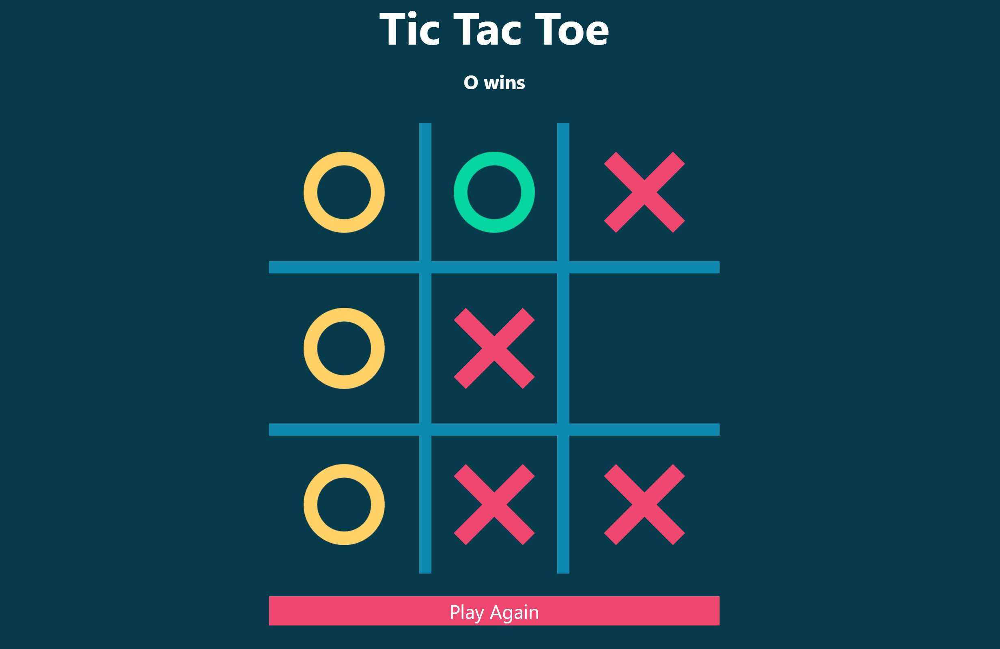

# Tic Tac Toe

This is a tic tac toe game that I created using react

## Description
This is a tic tac toe game that I created using react. I created this to practice my skills with react and to improve and to continue practicing and developing my react skills. It is a simple Tic Tac Toe game. When you win it will notify who won the game and the winning streak of three x's or o's will change color. And if you tie it will notify that too. You can reset the board at any time or play again after the game has been either won or tied. It is a two player game, but I could consider adding a single player option where the computer would play against you later on.  

## Installation
If you would like to download then feel free, I don't mind. In that case clone repo and run npm i and npm start to develop or view the code. To play just go to the url and start playing.

## Usage
This is a two player tic tac toe game and can be played by anone who is with a friend and wants to play tic tac toe. It works well on all screen sizes too, but is mostly intended for desktop use.

## Contribution
I was the sole Contributor

## Testing
NA

## About 
Author: [Dawson Bolen](https://github.com/DawsonBolen)  
Here is the [Repository](https://github.com/DawsonBolen/tic-tac-toe) 

This is the link to the deployed [site](https://dawsonbolen.github.io/tic-tac-toe/)

